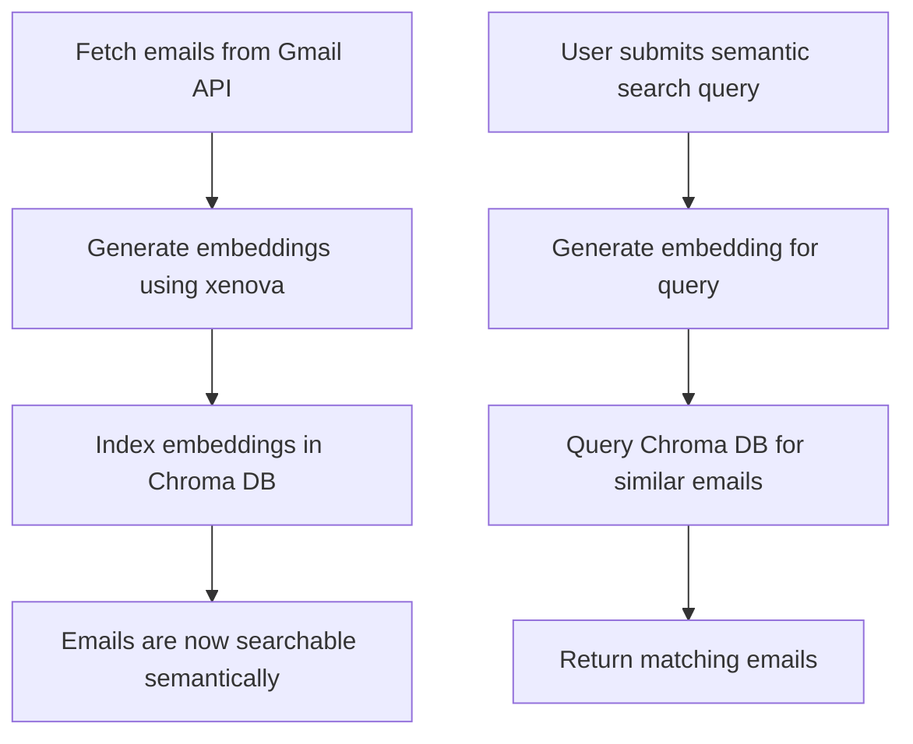

# Gmail MCP server

This MCP server integrates with Gmail APIs to list, delete, summarize, and send emails and labels.

## Prerequisites

- **Node.js & npm:** Ensure you have Node.js (v18 or higher recommended) and npm installed. [Download Node.js](https://nodejs.org/)
- **Docker (for RAG/Chroma DB):** If you want to use RAG features, install Docker: [Get Docker](https://docs.docker.com/get-docker/)

## Getting started

### Setup Google cloud project

- [Create a Google Cloud project](https://console.cloud.google.com/projectcreate)
- [Enable the Gmail API](https://console.cloud.google.com/workspace-api/products)
- [Configure an OAuth consent screen](https://console.cloud.google.com/apis/credentials/consent)
- If have workspace account then make it private
- Otherwise set some test users (emails against which want to test) to test before app is verified.
- [Create an OAuth Client ID](https://console.cloud.google.com/apis/credentials/oauthclient) for application type "Web App"
- Download the JSON file of your client's OAuth keys
- Rename the key file to `gcp-oauth-keys.json` and place into the root of the repo.

### Install dependencies

- Run `npm install` from the root directory to install all required dependencies.

## How to Run

1. **Build the project:**
   - Run `npm run build` from the root repo directory.
2. **Authenticate:**
   - Run `node dist/mcp.js auth`
   - This will open an authentication flow in your system browser
   - Note down the token generated is only valid for `1 hr` so relogin if get any error like `Error: No refresh token is set.`
   - Credentials will be saved in the root of this repo with file name `gmail-server-credentials.json`

## MCP Server Configuration Examples

### VS Code `settings.json`

To use this server in VS Code, add the following to your `settings.json`:

```json
{
  "mcpServers": {
    "gmail-mcp-server": {
      "type": "stdio",
      "command": "node",
      "args": ["<absolute path to dist/mcp.js>"],
      "env": {
        "GMAIL_OAUTH_PATH": "<absolute path to gmail-server-credentials.json>",
        "ENABLE_RAG": "false" // mark as true if want to use rag
      }
    }
  }
}
```

### Claude Desktop `claude_desktop_config.json`

To use this server in Claude Desktop, add the following to your `claude_desktop_config.json`:

```json
{
  "mcpServers": {
    "gmail-mcp-server": {
      "type": "stdio",
      "command": "node",
      "args": ["<absolute path to dist/mcp.js>"],
      "env": {
        "GMAIL_OAUTH_PATH": "<absolute path to gmail-server-credentials.json>",
        "ENABLE_RAG": "false" // mark as true if want to use rag
      }
    }
  }
}
```

Replace the placeholders (`<absolute path ...>`) with the actual full paths on your system for clarity and reliability.

## Environment Variables

- `GMAIL_OAUTH_PATH`: Absolute path to your Gmail OAuth credentials JSON file (e.g., `gmail-server-credentials.json`).
- `ENABLE_RAG`: Set to `true` to enable Retrieval-Augmented Generation (RAG) features; otherwise, set to `false`.

## Tools

- **get-gmail-profile**: Get Gmail profile details based on userId

  - `userId`: The user Gmail ID (string, required)

- **send-email**: Send an email to a given email address (supports attachments and HTML)

  - `to`: Recipient email address (string, required)
  - `subject`: Email subject (string, required)
  - `body`: Email body (string, required)
  - `isHtml`: Send as HTML email (boolean, optional, default: false)
  - `attachments`: Array of attachments (base64 encoded, optional)
    - `filename`: Attachment filename (string, required)
    - `mimeType`: MIME type (string, required)
    - `content`: Base64 encoded content (string, required)

- **create-label**: Create a new Gmail label

  - `name`: Label name (string, required)

- **delete-email**: Delete an email by message ID

  - `messageId`: ID of the email message (string, required)

- **summarize-top-k-emails**: Summarize the top k emails in the inbox

  - `k`: Number of top emails to summarize (number, required)

- **get-unread-emails**: Get unread emails from the inbox

  - `maxResults`: Maximum number of unread emails to fetch (number, optional, default: 10)

- **global-search-emails**: Search emails by subject, sender/recipient, time range, keyword, and label

  - `subject`: Subject to search for (string, optional)
  - `sender`: Sender email address (string, optional)
  - `recipient`: Recipient email address (string, optional)
  - `after`: Start date (YYYY/MM/DD) (string, optional)
  - `before`: End date (YYYY/MM/DD) (string, optional)
  - `keyword`: Keyword in body/snippet (string, optional)
  - `label`: Gmail label to filter by (string, optional)
  - `maxResults`: Maximum results (number, optional, default: 10)

- **list-gmail-labels**: List all Gmail labels for the authenticated user

  - No parameters required

- **delete-gmail-label**: Delete an gmail label by label ID

  - `labelId`: ID of the label (string, required)

- **vector-search-emails**: Semantic search for emails using vector embeddings (RAG)

  - `query`: The search query (string, required)
  - `k`: Number of top results to return (number, optional, default: 10)

## Running with Retrieval-Augmented Generation (RAG)

To enable semantic search and RAG features:

1. **Run Chroma DB locally**

   - Start a local Chroma DB instance for embedding storage and retrieval. You can use Docker:
     ```sh
     docker run -v ./chroma-data:/data -p 8000:8000 chromadb/chroma
     ```
     - This command mounts a local directory (`./chroma-data`) to the container's `/data` directory, ensuring your Chroma DB data persists even if the container is stopped or removed.
     - If you do not use the `-v` option, your data will be lost when the container is deleted.
   - Or follow the [Chroma DB documentation](https://docs.trychroma.com/docs/overview/getting-started?lang=typescript) for other setup options.

   - **Reference:**
     - [Chroma DB Docker Quickstart](https://docs.trychroma.com/deployment/docker)
     - [Chroma DB TypeScript Client](https://docs.trychroma.com/docs/overview/getting-started?lang=typescript)

2. **Indexing emails for embeddings**

   - Whenever you use any of the following tools:
     - `global-search-emails`
     - `summarize-top-k-emails`
     - `get-unread-emails`
   - The emails fetched will be automatically indexed and embedded into Chroma DB for future semantic search.

3. **Performing vector search**
   - Use the `vector-search-emails` tool to semantically search your indexed emails using natural language queries.

**Note:**

- Ensure Chroma DB is running before using RAG features.
- Only emails fetched through the above tools are indexed for semantic search.
- For best results, first fetch new emails to keep the index updated.

## RAG Flow: Embedding, Indexing, and Searching Emails

Below is a simplified Mermaid flowchart for how RAG is used to embed, index, and search emails:



- **Embedding:** When you fetch emails, their content is converted into vector embeddings using Xenova.
- **Indexing:** These embeddings are stored in Chroma DB for fast retrieval.
- **Semantic Search:** When you use `vector-search-emails`, your query is embedded and compared to indexed emails to find the most relevant matches.
